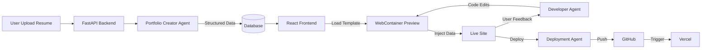

# 🚀 Showcase

<div align="center">

**An Intelligent Portfolio Generator Powered by AI**

*Transforming resumes into stunning portfolio websites—effortlessly.*

[](https://studentambassadors.microsoft.com/)
[](https://www.python.org/)
[](https://fastapi.tiangolo.com/)
[](https://reactjs.org/)

</div>

---

## 📖 About

**Showcase** is an intelligent web application that transforms your resume, project descriptions, and skill inventories into a sleek, personalized portfolio website. 

### ✨ New Architecture (v2) features
- 🏜️ **Hybrid "Sandbox" Architecture** - Zero-latency preview using Frontend WebContainers.
- 💉 **Data Injection Pipeline** - AI generates pure data, which is injected instantly into pre-built React templates.
- 🤖 **Developer Agent** - An AI agent that can modify the code of your chosen template based on your feedback (e.g., "Change the background to blue").
- 🚀 **True 1-Click Deployment** - Automagically pushes code to **GitHub** and deploys to **Vercel**.

---

## 🏗️ Architecture



---

## 📋 Prerequisites

Before you begin, ensure you have:

1.  **Python 3.11+** & **Node.js 18+**
2.  **Docker & Docker Compose** (for Database/Redis)
3.  **API Keys** (Crucial for functionality):
    -   **Gemini API Key**: For the AI Agents.
    -   **GitHub Token** (Personal Access Token with `repo` scope): For creating your portfolio repository.
    -   **Vercel Token**: For deploying your site to the world.

---

## 🚀 Quick Start Guide

### 1️⃣ Clone & Install

```bash
git clone <repository-url>
showcase
```

**Install All Dependencies (Backend + Frontend):**
```bash
make install           # Python dependencies
make install-frontend  # React dependencies
```

### 2️⃣ Configuration (Important!)

Create your `.env` file:
```bash
cp .env.example .env
```

**Edit `.env` and fill in these values:**
```ini
# AI Provider
GEMINI_API_KEY=your_gemini_key

# Deployment (Required for "Deploy" button)
GITHUB_TOKEN=ghp_xxxxxxxxxxxx
VERCEL_TOKEN=xxxxxxxxxxxx
```

### 3️⃣ Start the App

Start the infrastructure (Postgres/Redis) and all services:

```bash
# Terminal 1: Infrastructure
make dev-up
make upgrade  # Run migrations

# Terminal 2: Backend
make run-backend

# Terminal 3: Worker (For AI tasks)
make run-celery

# Terminal 4: Frontend
make run-frontend
```

---

## 📚 How to Use

1.  **Upload**: Go to `http://localhost:5173`, click "Upload Resume".
2.  **Watch**: See the Agent analyze your resume in real-time.
3.  **Preview**: The **Editor** will open. You will see your portfolio *instantly* via the WebContainer.
4.  **Refine**: Chat with the agent! "Make the title bigger", "Change the theme to dark". The **Developer Agent** will edit the code live.
5.  **Deploy**: Click "Publish". The **Deployment Agent** will create a GitHub repo and live Vercel URL for you.

---

## 📁 Project Structure

```
showcase/
├── app/                  # FastAPI Backend
├── agents/               # Agno Agents (Resume Analysis, Code Editing, Deployment)
├── frontend/             # React/Vite Frontend
│   └── src/
│       └── templates/    # Portfolio Templates (Loaded by WebContainer)
├── templates/            # Source Templates
└── docker-compose.yml    # Infrastructure
```

---

## 👥 Team

**MLSA KIIT Chapter**
Built with ❤️ by the Microsoft Learn Student Ambassadors community.

[⬆ Back to Top](#-showcase)
